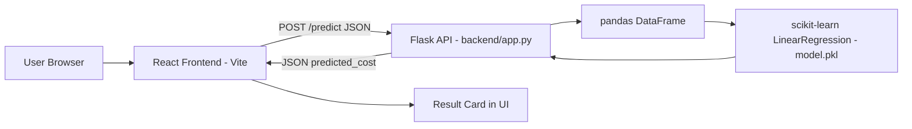
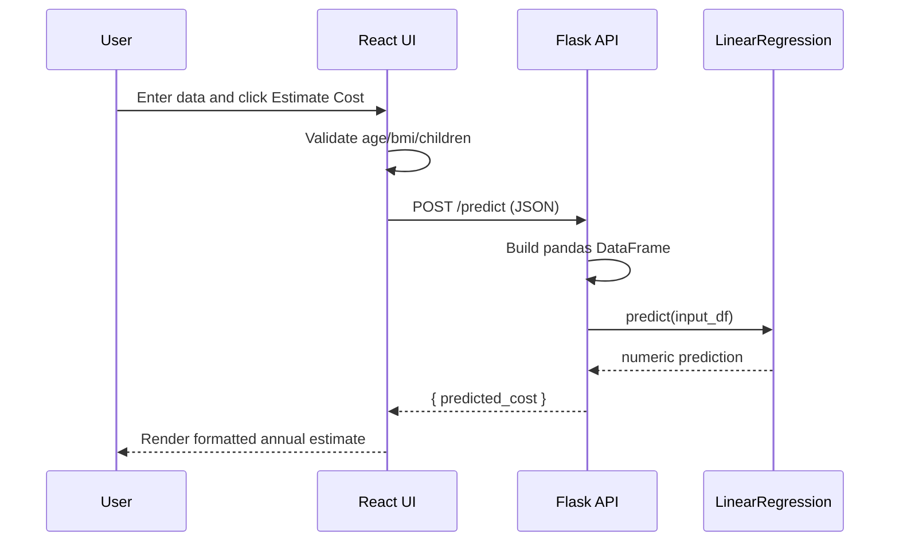
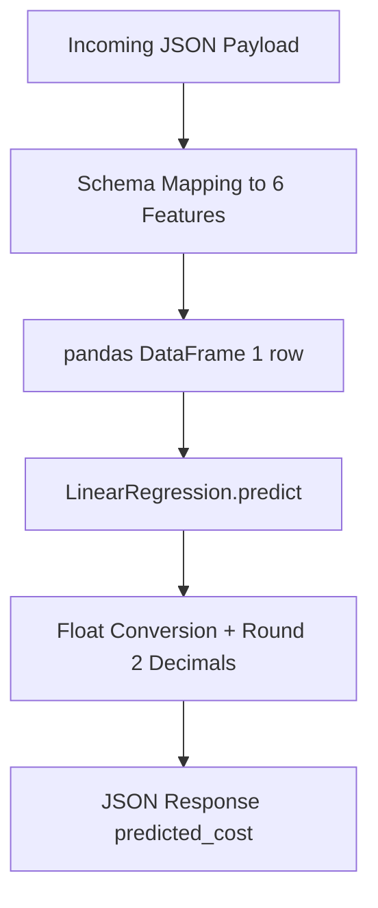
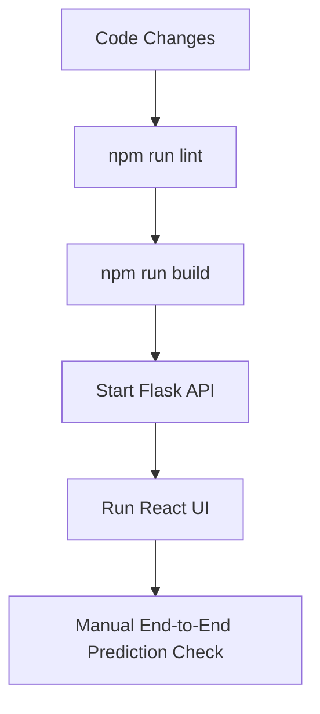

# Insurance Predictor

Full stack machine learning web app that estimates annual insurance cost from personal and health related inputs.

This README documents the complete project in this repository:

- `backend/` - Flask inference API and serialized ML model
- `frontend/` - React + Vite user interface

## 1) Introduction

Insurance Predictor is a lightweight ML-powered cost estimator. A user enters profile details such as age, BMI, smoking status, and region in the web app. The frontend validates the input and sends it to a Flask API, which runs a scikit-learn model and returns the predicted annual cost.

The project is designed as a practical end-to-end workflow example:

- UI data collection and client-side validation
- REST API inference endpoint
- Model loading and prediction
- Result rendering with clear feedback

## 2) Objective

Primary objective:

- Provide a fast, user-friendly insurance cost estimate from a small set of structured features.

Secondary objectives:

- Demonstrate full stack integration between React frontend and Flask backend.
- Demonstrate basic model serving using a serialized scikit-learn estimator.
- Provide a base project that can be extended with retraining, monitoring, and deployment.

## 3) Project Scope

In scope:

- Single prediction endpoint (`POST /predict`)
- Six input features
- Frontend form validation
- Light/dark theme UI
- Prediction result summary panel

Out of scope (current version):

- Authentication/authorization
- Batch prediction
- Model retraining pipeline in repo
- Automated test suite
- CI/CD workflows

## 4) System Architecture



## 5) Repository Structure

```text
insurance-predictor/
|- backend/
|  |- app.py
|  |- model.pkl
|- frontend/
|  |- index.html
|  |- package.json
|  |- package-lock.json
|  |- eslint.config.js
|  |- vite.config.js
|  |- public/
|  |  |- favicon.svg
|  |  |- icons.svg
|  |- src/
|  |  |- App.jsx
|  |  |- App.css
|  |  |- index.css
|  |  |- main.jsx
|  |  |- assets/
|  |  |  |- hero.png
|  |  |  |- react.svg
|  |  |  |- vite.svg
|  |- README.md
```

## 6) Technologies Used

### Frontend

- React 19
- Vite 8
- Axios
- CSS (custom, token-based theme variables)

### Backend

- Python 3.10+
- Flask
- Flask-CORS
- pandas
- NumPy
- scikit-learn (model deserialization and prediction)

### Model

- Algorithm: `sklearn.linear_model.LinearRegression`
- Serialized artifact: `backend/model.pkl`

## 7) Libraries Used

### Direct Frontend Dependencies (`frontend/package.json`)

Runtime:

- `axios` `^1.13.6`
- `react` `^19.2.4`
- `react-dom` `^19.2.4`

Dev tooling:

- `vite` `^8.0.1` (resolved to `8.0.2` in lockfile)
- `@vitejs/plugin-react` `^6.0.1`
- `eslint` `^9.39.4`
- `@eslint/js` `^9.39.4`
- `eslint-plugin-react-hooks` `^7.0.1`
- `eslint-plugin-react-refresh` `^0.5.2`
- `globals` `^17.4.0`
- `@types/react` `^19.2.14`
- `@types/react-dom` `^19.2.3`

Important lockfile-resolved transitive tooling includes:

- `rolldown` `1.0.0-rc.11`
- `lightningcss` `1.32.0`
- `postcss` `8.5.8`
- `hermes-parser` `0.25.1`
- `zod` `4.3.6`

### Backend Imports (`backend/app.py`)

- `flask`
- `flask_cors`
- `pickle`
- `numpy`
- `pandas`

## 8) Features

### User Experience

- Structured form with 6 model features
- Numeric input validation with inline error messages
- Light/dark theme toggle
- Loading state while inference runs
- API failure message when backend is unavailable
- Scroll-to-result behavior after successful prediction
- Reset action to clear form and output

### Model Inference

- Accepts JSON payload
- Builds a single-row pandas DataFrame with expected feature names
- Runs model inference (`model.predict`)
- Returns rounded currency-like value with two decimals

### API Behavior

- CORS enabled for local frontend-backend communication
- Single endpoint: `POST /predict`

## 9) Input Schema and Encoding

The app sends numeric encodings to the backend.

| Feature | Type | UI Options / Range | Encoding |
|---|---|---|---|
| `age` | number | 1 to 120 | raw numeric |
| `sex` | integer | Male / Female | `0=Male`, `1=Female` |
| `bmi` | number | 10 to 70 | raw numeric |
| `children` | integer | 0 to 10 | raw numeric |
| `smoker` | integer | Yes / No | `0=Smoker`, `1=Non-smoker` |
| `region` | integer | Southeast/Southwest/Northeast/Northwest | `0=Southeast`, `1=Southwest`, `2=Northeast`, `3=Northwest` |

## 10) API Contract

### Endpoint

- Method: `POST`
- URL: `http://localhost:5000/predict`
- Content-Type: `application/json`

### Request Body Example

```json
{
	"age": 32,
	"sex": 0,
	"bmi": 26.5,
	"children": 1,
	"smoker": 1,
	"region": 2
}
```

### Response Body Example

```json
{
	"predicted_cost": 11234.56
}
```

## 11) Workflow Steps

1. User enters feature values in the React form.
2. Frontend validates ranges and required fields.
3. On submit, frontend sends `POST /predict` using Axios.
4. Flask receives JSON and constructs a pandas DataFrame with ordered columns.
5. `model.pkl` predicts annual cost.
6. Backend rounds output to 2 decimals and returns JSON.
7. Frontend displays formatted prediction and input summary chips.

### Workflow Diagram (Request/Response)



## 12) Inference Pipeline Steps

1. `model.pkl` is loaded once at backend startup.
2. JSON request payload is parsed.
3. Features are mapped into this exact schema:
	 - `['age', 'sex', 'bmi', 'children', 'smoker', 'region']`
4. A single-row DataFrame is created.
5. Linear regression produces raw numeric output.
6. Value is cast to float, rounded to 2 decimals.
7. JSON response returns `predicted_cost`.

### Inference Pipeline Diagram



## 13) Model Details

Inspected model metadata:

- Estimator type: `sklearn.linear_model.LinearRegression`
- `n_features_in_`: `6`
- `feature_names_in_`: `age`, `sex`, `bmi`, `children`, `smoker`, `region`
- Pipeline wrapper (`steps`): not present (direct estimator object)

Learned coefficients from the artifact:

- Intercept: `11357.668742540951`
- `age`: `251.4051219591732`
- `sex`: `26.117159659121654`
- `bmi`: `330.64637156848545`
- `children`: `580.2743829604781`
- `smoker`: `-23928.1017106112`
- `region`: `212.22242728332387`

Linear prediction equation:

```text
predicted_cost = 11357.668742540951
							 + 251.4051219591732 * age
							 + 26.117159659121654 * sex
							 + 330.64637156848545 * bmi
							 + 580.2743829604781 * children
							 - 23928.1017106112 * smoker
							 + 212.22242728332387 * region
```

Note on encoding impact:

- Since `smoker` is encoded as `0=Smoker`, `1=Non-smoker`, the negative coefficient means moving from smoker to non-smoker lowers predicted cost.

## 14) Artifact Notes

- `backend/model.pkl`
	- Size: `634` bytes
	- Last modified (UTC): `2026-03-24T18:33:18.2095313Z`
- `frontend/src/assets/hero.png`
	- Size: `44,919` bytes
	- Last modified (UTC): `2026-03-24T19:03:29.3824912Z`

The model was originally serialized with scikit-learn `1.6.1`. Loading under a newer runtime can raise an `InconsistentVersionWarning`.

## 15) Local Setup and Run

### Prerequisites

- Node.js version compatible with Vite 8 (Node `^20.19.0` or `>=22.12.0` recommended)
- Python 3.10+

### Backend Setup

From repository root:

```powershell
cd backend
python -m venv .venv
.\.venv\Scripts\activate
pip install flask flask-cors pandas numpy scikit-learn==1.6.1
python app.py
```

Backend runs on:

- `http://localhost:5000`

Important:

- Run `app.py` from inside `backend/` so relative path `model.pkl` resolves correctly.

### Frontend Setup

From repository root:

```powershell
cd frontend
npm install
npm run dev
```

Frontend default dev server:

- `http://localhost:5173`

### Production Build (Frontend)

```powershell
cd frontend
npm run lint
npm run build
npm run preview
```

## 16) Build/Delivery Pipeline (Current State)

No CI pipeline files are present in this repository yet. The current flow is local-first.

### Current Local Pipeline Steps

1. Develop backend and frontend locally.
2. Run frontend lint (`npm run lint`).
3. Build frontend (`npm run build`).
4. Start backend (`python app.py`).
5. Manually verify inference through the UI.

### Current Pipeline Diagram



## 17) Known Limitations

- No backend input schema validation or error handling for malformed payload keys.
- API does not expose model version metadata.
- No tests (unit/integration/E2E) in current codebase.
- No retraining scripts or dataset included in repository.
- No containerization or deployment manifests provided.

## 18) Recommended Next Improvements

- Add backend request validation (for example, Pydantic or marshmallow).
- Add structured logging and error responses.
- Add tests for API contract and UI flows.
- Add model versioning and artifact metadata endpoint.
- Add Docker and CI workflow.
- Externalize API base URL via environment variables.

## 19) Quick Start Summary

1. Start backend in `backend/` with Flask on port `5000`.
2. Start frontend in `frontend/` with Vite.
3. Open the app, fill the form, and click **Estimate Cost**.
4. Review returned annual prediction and summary chips.
